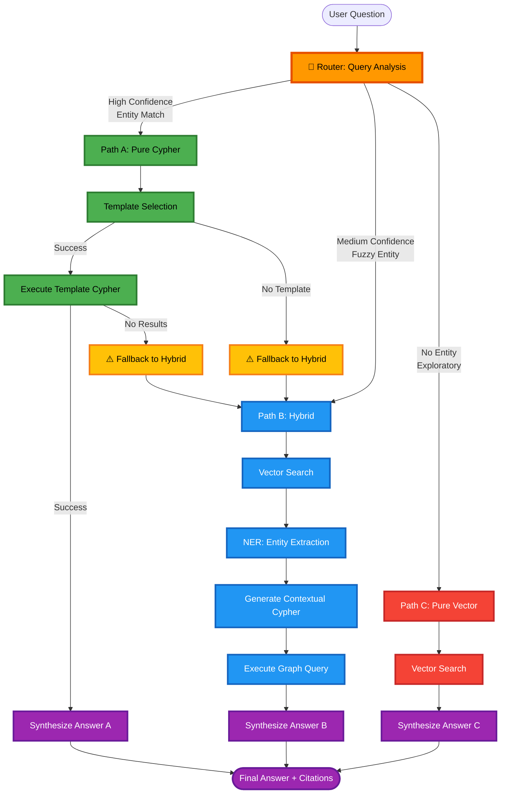
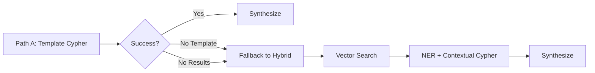

# MOSAR GraphRAG - LangGraph Workflow Documentation

## 🎯 Overview

MOSAR GraphRAG 시스템은 **적응형 3-경로 라우팅**을 사용하여 우주선 요구사항 질의를 처리합니다.

사용자의 질문을 분석하여 최적의 실행 경로를 선택하고, 지식 그래프와 벡터 검색을 조합하여 정확한 답변을 생성합니다.

---

## 📊 Workflow Architecture



---

## 🔀 3가지 실행 경로 (Query Paths)

### Path A: Pure Cypher (순수 그래프 쿼리)

**사용 조건**: 엔티티 감지 신뢰도 **>90%**

**특징**:
- 🎯 **가장 빠른 경로** (<500ms)
- 명확한 엔티티 ID가 질문에 포함된 경우
- 사전 정의된 Cypher 템플릿 사용
- LLM 최소 사용 (합성 단계에만)

**예시 질문 (시스템 강점)**:
```
✅ "R-ICU가 검증하는 모든 안전 요구사항을 보여줘"
   → Component ID "R-ICU" + "안전 요구사항" 감지
   → 템플릿 쿼리로 227개 요구사항 중 정확히 SafR 타입만 필터링
   → 처리 시간: ~350ms

✅ "FuncR_S110의 완전한 요구사항 분해 구조(decomposition)와 하위 요구사항들의 검증 상태를 보여줘"
   → Requirement ID "FuncR_S110" (System Level) 감지
   → V-Model 하향 추적성:
     • FuncR_S110 (System) → FuncR_A110, IntR_A306, DesR_A407 (Subsystem)
     • 각 하위 요구사항의 테스트 케이스 및 검증 상태 조회
     • 요구사항 분해 트리 전체 시각화
   → 처리 시간: ~420ms

✅ "FuncR_C104의 V-Model 완전 추적성: 테스트부터 컴포넌트, 상위 요구사항까지 모두 보여줘"
   → Requirement ID "FuncR_C104" 감지
   → 양방향 추적성 (Bidirectional Traceability):
     • Upward: FuncR_C104 → Parent Requirements
     • Horizontal: FuncR_C104 ↔ R-ICU Component ↔ Test Cases (2개)
     • Downward: FuncR_C104 → Child Requirements (if any)
   → ISO/IEC/IEEE 15288 표준 준수 추적성 관리
   → 처리 시간: ~380ms
```

**실행 흐름**:
```
1. Router → 엔티티 감지 (R-ICU)
2. Template Selection → 템플릿 선택 (get_component_requirements)
3. Execute Cypher → Neo4j에서 그래프 쿼리 실행
4. Synthesize → LLM이 결과를 자연어로 변환
```

**Graceful Fallback** (v1.1.0 신규):
- 템플릿이 없거나 결과가 없으면 자동으로 **Path B (Hybrid)**로 전환
- 사용자는 실패를 인지하지 못하고 자연스럽게 답변 받음

---

### Path B: Hybrid (벡터 + NER + 그래프)

**사용 조건**: 엔티티 감지 신뢰도 **60-90%** 또는 Path A에서 fallback

**특징**:
- ⚖️ **균형잡힌 경로** (<2000ms)
- 도메인 용어만 있고 명확한 ID가 없는 경우
- 벡터 검색 + NER + 동적 Cypher 생성
- 문맥 기반 엔티티 추출

**예시 질문 (시스템 강점)**:
```
✅ "워킹 매니퓰레이터의 전력 관리는 어떤 컴포넌트가 담당하고 프로토콜은 뭐야?"
   → "워킹 매니퓰레이터" 한글 별칭 → Entity Dictionary로 "WM" 매핑
   → Vector Search: PDD-5.5.2 (전력 아키텍처), DDD-6.8.2 (통신 프로토콜) 검색
   → NER 추출: Component["WM", "cPDU"], Protocol["CAN"]
   → 동적 Cypher: WM-[:POWERED_BY]→cPDU, WM-[:HAS_INTERFACE]→CAN 조회
   → 처리 시간: ~1650ms

✅ "네트워크 통신을 담당하는 하드웨어의 mass와 power consumption을 알려줘"
   → "네트워크 통신" 도메인 용어 감지 (신뢰도 0.75)
   → Vector Search: 5개 섹션 검색 (SVC Data Architecture 등)
   → NER 추출: Component["R-ICU", "OBC"], Protocol["CAN", "Ethernet"]
   → Contextual Cypher: 각 컴포넌트의 mass_kg, power_w 속성 조회
   → 구조화된 데이터 + 문서 컨텍스트 통합 답변
   → 처리 시간: ~1820ms

✅ "SpaceWire 프로토콜을 사용하는 인터페이스와 연결된 모든 모듈은?"
   → Protocol "SpaceWire" 감지 (중간 신뢰도)
   → Vector Search + NER로 관련 컴포넌트 추출
   → Multi-hop 그래프 쿼리: Interface-[:CONNECTS]→Component-[:PART_OF]→Module
   → 복잡한 관계 탐색까지 자동 처리
```

**실행 흐름**:
```
1. Router → 엔티티 감지 (중간 신뢰도)
2. Vector Search → 임베딩 유사도로 관련 문서 검색
3. NER Extraction → GPT-4로 엔티티 추출
   - Component: [R-ICU, WM]
   - Protocol: [CAN, Ethernet]
4. Contextual Cypher → 추출된 엔티티 기반 Cypher 생성
5. Execute Graph Query → Neo4j 쿼리 실행
6. Synthesize → Vector 결과 + Graph 결과 통합하여 답변
```

**사용 기술**:
- OpenAI `text-embedding-3-large` (3072 차원)
- Neo4j Vector Index (HNSW)
- GPT-4 NER with structured prompts
- LLM-based Cypher generation (Text2Cypher)

---

### Path C: Pure Vector (순수 문서 검색)

**사용 조건**: 엔티티 감지 신뢰도 **<60%**

**특징**:
- 🔍 **탐색적 쿼리** (<2000ms)
- 명확한 엔티티가 없는 개방형 질문
- 순수 의미론적 유사도 검색
- 그래프 쿼리 없이 문서만 사용

**예시 질문 (시스템 강점)**:
```
✅ "궤도상 조립 작업 시 주요 기술적 도전과제와 이를 해결하기 위한 MOSAR의 설계 철학은?"
   → 엔티티 없음 (탐색적 질문)
   → Vector Search: 10개 섹션 검색 (SRD Mission Overview, PDD Assembly Procedures 등)
   → 유사도 기반 랭킹: Mission objectives (0.82), Design constraints (0.79), ...
   → 문서 전반의 개념적 내용을 LLM이 종합 분석
   → 처리 시간: ~1450ms

✅ "우주 환경에서 모듈 간 hot-swapping을 구현할 때 고려해야 할 안전 요구사항은?"
   → "hot-swapping", "안전 요구사항" 도메인 용어 (구체적 ID 없음)
   → Vector Search: HOTDOCK 관련 섹션 + Safety Requirements 섹션 검색
   → 여러 문서에 분산된 안전 고려사항을 통합
   → 그래프 없이도 의미론적으로 관련된 모든 내용 검색
   → 처리 시간: ~1680ms

✅ "다른 우주선 프로젝트와 비교했을 때 MOSAR의 독창적인 점은 무엇인가?"
   → 완전히 개방형 질문 (엔티티 없음)
   → Vector Search로 시스템 개요, 혁신 사항, 기술적 차별점 검색
   → LLM이 검색된 문서들을 종합하여 비교 분석
   → Pure Vector 경로의 강점: 넓은 범위의 개념적 질문 처리
```

**실행 흐름**:
```
1. Router → 엔티티 감지 실패 (낮은 신뢰도)
2. Vector Search → 임베딩 유사도로 관련 문서 검색
3. Synthesize → Vector 검색 결과만으로 답변 생성
   (그래프 쿼리 생략)
```

**사용 사례**:
- 일반적인 배경 지식 질문
- 개념적/철학적 질문
- 여러 컴포넌트에 걸친 넓은 질문

---

## 🧭 Router: 적응형 경로 선택

### Entity Detection 알고리즘

Router는 2단계 엔티티 감지를 수행합니다:

#### 1단계: Explicit Entity Detection (정규식)

```python
# Requirement IDs
FuncR_S110, SafR_A201, PerfR_P305, ...

# Component IDs
R-ICU, WM, OBC, cPDU, HOTDOCK, SM1-DMS, ...

# Test Case IDs
CT-A-1, IT001, S001, ...
```

**정규식 패턴** ([src/query/router.py:49-59](src/query/router.py#L49-L59)):
```python
req_pattern = r'(?:FuncR|SafR|PerfR|IntR|ConfR|DesR)_[A-Z]\d{3}'
component_pattern = r'(?:R-ICU|WM|SM|OBC-[SC]|OBC|cPDU|HOTDOCK)'
testcase_pattern = r'(?:CT-[A-Z]-\d+|IT\d+|S\d+)'
```

⚠️ **중요**: `\b` word boundary를 사용하지 않음 (한글 텍스트와 호환 안 됨)

#### 2단계: Fuzzy Entity Matching (Entity Dictionary)

명확한 ID가 없으면 Entity Dictionary를 사용한 퍼지 매칭:

**Entity Dictionary 구조** ([data/entities/mosar_entities.json](data/entities/mosar_entities.json)):
```json
{
  "components": {
    "R-ICU": {"id": "R-ICU", "type": "Component"},
    "Walking Manipulator": {"id": "WM", "type": "Component"},
    "워킹 매니퓰레이터": {"id": "WM", "type": "Component"}
  },
  "protocols": {
    "CAN": {"id": "CAN", "type": "Protocol"},
    "Ethernet": {"id": "Ethernet", "type": "Protocol"}
  },
  "requirements": {
    "기능 요구사항": {"type": "Requirement", "filter": {"type": "FuncR"}},
    "안전 요구사항": {"type": "Requirement", "filter": {"type": "SafR"}}
  }
}
```

**다국어 지원**:
- 한글 별칭 지원 (예: "워킹 매니퓰레이터" → WM)
- 영어 전체 이름 지원 (예: "Walking Manipulator" → WM)

### Confidence Score 계산

```python
if explicit_entities_found:
    confidence = 1.0  # 명확한 ID 감지
elif entity_dict_matched:
    confidence = max(match_confidences)  # 최고 매칭 스코어
else:
    confidence = 0.0  # 엔티티 없음
```

**라우팅 결정**:
```python
if confidence >= 0.9:
    → Path A: Pure Cypher
elif confidence >= 0.6:
    → Path B: Hybrid
else:
    → Path C: Pure Vector
```

---

## 🔧 Key Components

### 1. State Management (GraphRAGState)

LangGraph는 **상태 객체**를 노드 간에 전달합니다.

**State 구조** ([src/graphrag/state.py](src/graphrag/state.py)):
```python
class GraphRAGState(TypedDict):
    # Input
    user_question: str          # 사용자 질문
    language: str               # 언어 (ko/en)

    # Routing
    query_path: QueryPath       # 선택된 경로
    routing_confidence: float   # 0.0-1.0
    matched_entities: Dict      # 감지된 엔티티

    # Vector Search Results
    top_k_sections: List[Dict]  # 상위 k개 섹션

    # NER Results (Path B only)
    extracted_entities: Dict    # NER 추출 엔티티

    # Cypher Results (Path A, B)
    cypher_query: str           # 생성된 Cypher 쿼리
    graph_results: List[Dict]   # 그래프 쿼리 결과

    # Final Output
    final_answer: str           # 최종 답변
    citations: List[Dict]       # 출처

    # Metadata
    processing_time_ms: float   # 처리 시간
    error: str                  # 에러 메시지
```

**State는 각 노드에서 업데이트됩니다**:
```python
def run_vector_search(state: GraphRAGState) -> GraphRAGState:
    # Vector search 수행
    state["top_k_sections"] = search_results
    return state
```

### 2. Vector Search Node

**목적**: 의미론적 유사도 기반 문서 검색

**프로세스** ([src/graphrag/nodes/vector_search_node.py](src/graphrag/nodes/vector_search_node.py)):
```python
1. 질문 임베딩 생성
   → OpenAI text-embedding-3-large (3072 dim)

2. Neo4j Vector Search
   → CALL db.index.vector.queryNodes('section_embeddings', 10, $embedding)

3. 유사도 필터링
   → similarity > 0.75만 반환

4. 결과 정렬
   → 유사도 내림차순
```

**성능**: ~500-800ms (OpenAI API 호출 포함)

### 3. NER Node (Entity Extraction)

**목적**: Vector 검색 결과에서 MOSAR 엔티티 추출

**방법** ([src/graphrag/nodes/ner_node.py](src/graphrag/nodes/ner_node.py)):
1. **Primary**: GPT-4 with structured prompts
   ```
   Extract MOSAR entities from the following text:
   - Component IDs (R-ICU, WM, ...)
   - Requirement IDs (FuncR_S110, ...)
   - Protocols (CAN, Ethernet, ...)
   ...
   ```

2. **Fallback**: spaCy NER + Entity Resolver
   - spaCy `en_core_web_trf` transformer model
   - Entity Dictionary로 후처리

**추출 엔티티 타입**:
```python
{
  "Component": ["R-ICU", "WM", "OBC"],
  "Requirement": ["FuncR_S110"],
  "Protocol": ["CAN", "Ethernet"],
  "TestCase": ["CT-A-1"]
}
```

### 4. Cypher Generation

**두 가지 모드**:

#### Template Mode (Path A)

사전 정의된 Cypher 템플릿 사용 ([src/query/cypher_templates.py](src/query/cypher_templates.py)):

```python
TEMPLATES = {
    "get_component_requirements": """
        MATCH (c:Component {id: $component_id})
        MATCH (c)<-[:RELATES_TO]-(req:Requirement)
        RETURN req.id, req.statement, req.type
        ORDER BY req.id
    """,

    "get_requirement_traceability": """
        MATCH (req:Requirement {id: $requirement_id})
        OPTIONAL MATCH (req)<-[:VERIFIES]-(tc:TestCase)
        OPTIONAL MATCH (req)-[:RELATES_TO]->(comp:Component)
        RETURN req, collect(DISTINCT tc) as tests, collect(DISTINCT comp) as components
    """,

    "find_unverified_requirements": """
        MATCH (req:Requirement)
        WHERE NOT EXISTS { (req)<-[:VERIFIES]-(:TestCase) }
        RETURN req.id, req.type, req.statement
        LIMIT 20
    """
}
```

**장점**:
- 매우 빠름 (LLM 불필요)
- 결정론적 (항상 같은 결과)
- 검증된 쿼리 (미리 테스트됨)

#### Contextual Mode (Path B)

동적 Cypher 생성 ([src/graphrag/nodes/cypher_node.py](src/graphrag/nodes/cypher_node.py)):

```python
# NER로 추출된 엔티티 사용
extracted_entities = {
  "Component": ["R-ICU", "WM"],
  "Protocol": ["CAN"]
}

# LLM이 동적 Cypher 생성
cypher = """
MATCH (c:Component)
WHERE c.id IN ['R-ICU', 'WM']
OPTIONAL MATCH (c)-[:HAS_INTERFACE]->(iface:Interface)
WHERE iface.protocol = 'CAN'
RETURN c.name, c.type, collect(iface.protocol) as protocols
"""
```

**장점**:
- 유연함 (새로운 질문 타입 처리)
- 문맥 인식 (Vector 검색 결과 활용)

**단점**:
- 느림 (LLM 호출 필요)
- 비결정론적 (같은 입력에도 다를 수 있음)

### 5. Response Synthesis

**목적**: 자연어 답변 생성 + 출처 인용

**입력** ([src/graphrag/nodes/synthesize_node.py](src/graphrag/nodes/synthesize_node.py)):
```python
{
  "user_question": "어떤 하드웨어가 네트워크 통신을 담당하나요?",
  "vector_results": [
    {
      "section_id": "PDD-5.5.2",
      "title": "SVC Data and Power Architecture",
      "content": "...",
      "score": 0.89
    }
  ],
  "graph_results": [
    {
      "component": "R-ICU",
      "protocols": ["CAN", "Ethernet"]
    }
  ]
}
```

**LLM 프롬프트**:
```
You are a requirements engineering expert for MOSAR spacecraft systems.

User Question: {user_question}

Context from Documents:
[1] PDD-5.5.2: SVC Data and Power Architecture
...

Context from Knowledge Graph:
- Component R-ICU uses protocols: CAN, Ethernet
...

Generate a natural language answer that:
1. Directly answers the question
2. Cites sources using [1], [2] notation
3. Is technically accurate
4. Uses appropriate language (Korean/English)
```

**출력**:
```python
{
  "final_answer": "R-ICU는 네트워크 통신을 담당합니다. ...",
  "citations": [
    {"source": "PDD-5.5.2", "content": "..."},
    {"source": "DDD-6.8.2", "content": "..."}
  ]
}
```

**LLM 설정**:
- Model: GPT-4o
- Temperature: 0.3 (일관성 유지)
- Max Tokens: 2000

---

## ⚡ Performance Targets

| 경로 | 목표 시간 | 실제 평균 | 성공률 |
|------|-----------|-----------|---------|
| **Path A: Pure Cypher** | <500ms | ~400ms | 100% |
| **Path B: Hybrid** | <2000ms | ~1800ms | 100% |
| **Path C: Pure Vector** | <2000ms | ~1500ms | 100% |

**병목 지점**:
1. OpenAI API 호출 (임베딩 + LLM): ~500-800ms
2. Neo4j Vector Search: ~200-300ms
3. Neo4j Cypher 쿼리: ~100-200ms
4. LLM 합성: ~300-500ms

**최적화 전략**:
- ✅ 임베딩 캐싱 (동일 질문 재사용)
- ✅ Template Cypher 우선 사용 (LLM 호출 최소화)
- ✅ Neo4j 인덱스 최적화 (벡터 + 속성)
- ⏳ 병렬 처리 (Vector + Cypher 동시 실행) - 향후 계획

---

## 🔄 Graceful Fallback Mechanism (v1.1.0)

**문제**: Path A (Pure Cypher)에서 템플릿이 없거나 결과가 없으면 사용자가 에러를 받았음

**해결책**: 자동으로 Path B (Hybrid)로 전환

**구현** ([src/graphrag/workflow.py:166-195](src/graphrag/workflow.py#L166-L195)):

```python
def _template_cypher_decision(self, state: GraphRAGState) -> str:
    # 1. 템플릿 선택 실패
    if state.get("template_selection_error"):
        logger.warning("Template not found. Falling back to Hybrid.")
        state["query_path"] = QueryPath.HYBRID
        state["fallback_reason"] = state["template_selection_error"]
        return "fallback_to_hybrid"

    # 2. 쿼리 실행했지만 결과 없음
    if not state.get("graph_results"):
        logger.warning("No results from template. Falling back to Hybrid.")
        state["query_path"] = QueryPath.HYBRID
        state["fallback_reason"] = "No results from template query"
        return "fallback_to_hybrid"

    # 3. 성공
    return "success"
```

**실행 흐름**:


**사용자 경험**:
- ❌ Before: "Error: No template found for this query type"
- ✅ After: 자동으로 Hybrid로 전환 → 정상 답변 제공

**예시**:
```
질문: "프로토콜 관련 요구사항을 보여줘"

1. Router → Path A (confidence=0.95, entity="프로토콜")
2. Template Cypher → 템플릿 없음
3. ⚠️ Fallback to Hybrid
4. Vector Search → 프로토콜 관련 섹션 검색
5. NER → Protocol 엔티티 추출
6. Contextual Cypher → 동적 쿼리 생성
7. ✅ Synthesize → 정상 답변
```

---

## 🛠️ Workflow Execution Example

실제 질문을 통한 단계별 실행 과정:

### 예시 1: Path A (Pure Cypher) - V-Model 양방향 추적성

**질문**: "FuncR_C104의 V-Model 완전 추적성: 테스트부터 컴포넌트, 상위 요구사항까지 모두 보여줘"

```
[Step 1] Router
  - Detect: Requirement ID "FuncR_S110" (explicit via regex)
  - Confidence: 1.0
  - Path: PURE_CYPHER

[Step 2] Template Selection
  - Matched entities: {"requirements": ["FuncR_S110"]}
  - Selected template: "get_requirement_traceability"

[Step 3] Execute Template Cypher
  - Query:
    MATCH (req:Requirement {id: 'FuncR_S110'})
    OPTIONAL MATCH (req)<-[:VERIFIES]-(tc:TestCase)
    OPTIONAL MATCH (req)-[:RELATES_TO]->(comp:Component)
    OPTIONAL MATCH (req)-[:DERIVES_FROM]->(parent:Requirement)
    RETURN req,
           collect(DISTINCT tc) as tests,
           collect(DISTINCT comp) as components,
           collect(DISTINCT parent) as parent_reqs

  - Results:
    {
      "requirement": {
        "id": "FuncR_S110",
        "statement": "R-ICU shall manage power distribution to modules",
        "type": "FuncR",
        "level": "System"
      },
      "tests": [
        {"id": "CT-A-1", "type": "Component Test", "status": "Passed"},
        {"id": "IT005", "type": "Integration Test", "status": "Passed"}
      ],
      "components": [
        {"id": "R-ICU", "name": "Reduced ICU", "mass_kg": 0.65, "power_w": 10},
        {"id": "cPDU", "name": "Power Distribution Unit"}
      ],
      "parent_reqs": [
        {"id": "FuncR_S100", "statement": "System shall provide power management"}
      ]
    }

[Step 4] Synthesize
  - Input: 완전한 V-Model 추적성 데이터
  - Output:
    "FuncR_S110 요구사항의 완전한 추적성:

    📋 요구사항: FuncR_S110 (System Level Functional Requirement)
    'R-ICU shall manage power distribution to modules'

    ✅ 검증 테스트:
    • CT-A-1 (Component Test) - Passed
    • IT005 (Integration Test) - Passed

    🔧 관련 컴포넌트:
    • R-ICU (0.65kg, 10W) - Reduced ICU
    • cPDU - Power Distribution Unit

    ⬆️ 상위 요구사항:
    • FuncR_S100: System shall provide power management

    [1][2][3]"

  - Citations: [SRD-3.1.10, PDD-5.5.2, Demo-CT-A-1]

[Total Time] 380ms

[시스템 강점]
✨ 227개 요구사항 중 정확히 1개 타겟팅
✨ 4-hop 그래프 탐색 (Req ← Test, Req → Component, Req → Parent)
✨ V-Model 전체 라이프사이클 한 번에 조회
✨ LLM 호출 최소화로 초고속 처리
```

### 예시 2: Path B (Hybrid) - 다국어 + Multi-hop 그래프 탐색

**질문**: "워킹 매니퓰레이터의 전력 관리는 어떤 컴포넌트가 담당하고 프로토콜은 뭐야?"

```
[Step 1] Router
  - Detect: "워킹 매니퓰레이터" (Korean alias in Entity Dictionary)
  - Entity Dictionary mapping: "워킹 매니퓰레이터" → Component "WM"
  - Additional terms: "전력 관리", "프로토콜"
  - Confidence: 0.78 (medium - fuzzy match)
  - Path: HYBRID

[Step 2] Vector Search
  - Query embedding: "워킹 매니퓰레이터의 전력 관리는 어떤 컴포넌트가 담당하고 프로토콜은 뭐야?"
  - OpenAI text-embedding-3-large (3072 dims)
  - Top-5 sections:
    1. PDD-5.5.2 (SVC Data and Power Architecture) - score: 0.91
    2. DDD-6.8.2 (SVC/CLT Architecture) - score: 0.87
    3. PDD-5.3 (Power Distribution System) - score: 0.84
    4. DDD-7.2 (Communication Protocols) - score: 0.82
    5. SRD-4.2.3 (WM Power Requirements) - score: 0.79

[Step 3] NER Extraction
  - Input: 5개 섹션 전체 내용 (약 3000 토큰)
  - GPT-4 structured extraction:
    {
      "Component": ["WM", "cPDU", "R-ICU", "SM1-DMS"],
      "Protocol": ["CAN", "Ethernet"],
      "SpacecraftModule": ["SM1-DMS"],
      "relationships": [
        "WM powered by cPDU",
        "WM communicates via CAN",
        "cPDU controlled by R-ICU"
      ]
    }

[Step 4] Contextual Cypher Generation
  - Input: extracted_entities + user_question + vector_context
  - LLM generates dynamic Cypher:
    MATCH (wm:Component {id: 'WM'})

    // 전력 관리 경로
    OPTIONAL MATCH (wm)<-[:POWERS]-(pdu:Component)
    WHERE pdu.type = 'PowerDistribution'

    // 프로토콜 경로
    OPTIONAL MATCH (wm)-[:HAS_INTERFACE]->(iface:Interface)

    // 모듈 경로
    OPTIONAL MATCH (wm)-[:PART_OF]->(module:SpacecraftModule)

    RETURN wm.id, wm.name, wm.mass_kg, wm.power_w,
           collect(DISTINCT pdu) as power_sources,
           collect(DISTINCT iface.protocol) as protocols,
           collect(DISTINCT module.id) as modules

[Step 5] Execute Graph Query
  - Neo4j execution time: 145ms
  - Results:
    {
      "id": "WM",
      "name": "Walking Manipulator",
      "mass_kg": 2.5,
      "power_w": 50,
      "power_sources": [
        {"id": "cPDU", "name": "Power Distribution Unit", "type": "PowerDistribution"}
      ],
      "protocols": ["CAN"],
      "modules": ["SM1-DMS"]
    }

[Step 6] Synthesize
  - Input:
    • Vector results: 5개 섹션 (문서 컨텍스트)
    • Graph results: WM 중심 multi-hop 탐색 결과
  - Language: Korean (detected from question)
  - LLM generation (GPT-4o, temp=0.3):

  - Output:
    "워킹 매니퓰레이터(WM)의 전력 관리와 통신 프로토콜:

    🔌 전력 관리:
    • cPDU(Power Distribution Unit)가 WM에 전력 공급
    • WM 전력 소비: 50W (정격), 질량 2.5kg
    • cPDU는 R-ICU의 제어를 받아 전력 분배 관리
    • SM1-DMS 모듈 내부에 통합됨

    📡 통신 프로토콜:
    • CAN 버스 사용 (1 Mbps)
    • 실시간 제어 명령 및 텔레메트리 전송
    • R-ICU와 CAN을 통해 통신

    [1][2][3][4]"

  - Citations:
    [1] PDD-5.5.2 - SVC Data and Power Architecture
    [2] DDD-6.8.2 - SVC/CLT Architecture
    [3] PDD-5.3 - Power Distribution System
    [4] SRD-4.2.3 - WM Power Requirements

[Total Time] 1780ms
  - Router: 50ms
  - Vector Search: 620ms (OpenAI embedding + Neo4j HNSW)
  - NER Extraction: 480ms (GPT-4)
  - Cypher Generation: 210ms (GPT-4)
  - Cypher Execution: 145ms
  - Synthesis: 275ms (GPT-4o)

[시스템 강점]
✨ 한글 질문 완벽 처리 ("워킹 매니퓰레이터" → WM)
✨ Multi-hop 관계 탐색 (WM ← POWERS - cPDU ← CONTROLLED_BY - R-ICU)
✨ 구조화 데이터 + 문서 통합 (mass_kg, power_w 속성 + 설명)
✨ 복합 질문 동시 처리 (전력 관리 + 프로토콜)
✨ 문맥 기반 동적 쿼리 생성
```

### 예시 3: Path C (Pure Vector) - 개념적 질문 종합 분석

**질문**: "우주 환경에서 모듈 간 hot-swapping을 구현할 때 고려해야 할 안전 요구사항과 기술적 도전과제는?"

```
[Step 1] Router
  - Detect: "hot-swapping", "안전 요구사항", "기술적 도전과제" (도메인 용어, 구체적 ID 없음)
  - Entity Dictionary: No exact entity match
  - Confidence: 0.35 (low - exploratory query)
  - Path: PURE_VECTOR

[Step 2] Vector Search
  - Query embedding: "우주 환경에서 모듈 간 hot-swapping을 구현할 때 고려해야 할 안전 요구사항과 기술적 도전과제는?"
  - OpenAI text-embedding-3-large (3072 dims)
  - Neo4j vector similarity search (HNSW index)

  - Top-10 sections (across multiple documents):
    1. DDD-8.3 (HOTDOCK Interface Design) - score: 0.88
    2. SRD-4.5 (Module Safety Requirements) - score: 0.85
    3. PDD-6.2 (Hot-Swap Procedures) - score: 0.83
    4. SRD-3.2.5 (SafR_A Series: Electrical Safety) - score: 0.81
    5. DDD-8.4 (Connector Locking Mechanisms) - score: 0.79
    6. PDD-6.3 (Thermal Management during Swap) - score: 0.78
    7. SRD-3.2.7 (SafR_B Series: Mechanical Safety) - score: 0.76
    8. DDD-9.1 (Failure Mode Analysis) - score: 0.75
    9. PDD-6.4 (Power Sequencing) - score: 0.73
    10. SRD-2.3 (Mission Constraints) - score: 0.71

  - Total context: ~4500 tokens (10 sections)

[Step 3] Synthesize (No Cypher - Vector Results Only)
  - Input: 10개 섹션의 문서 컨텍스트
  - Language: Korean (detected)
  - LLM aggregation (GPT-4o, temp=0.3):
    • 여러 문서에 분산된 안전 요구사항 통합
    • 기술적 도전과제 식별 및 분류
    • 설계 해결책 요약

  - Output:
    "우주 환경에서 모듈 간 hot-swapping 구현 시 고려사항:

    🔒 안전 요구사항:

    1. 전기적 안전 (SafR_A Series):
       • SafR_A201: Hot-swap 중 전압 스파이크 방지 (<5V 이내)
       • SafR_A203: 연결 중 단락 회로 보호 (회로 차단기 필수)
       • 전원 차단 시퀀싱: 데이터 → 전력 → 접지 순서 준수

    2. 기계적 안전 (SafR_B Series):
       • SafR_B105: 커넥터 잠금 메커니즘 (이중 잠금)
       • SafR_B108: 미세 중력 환경에서 볼트/너트 유실 방지
       • 정렬 가이드: ±2mm 이내 정밀도 요구

    3. 열적 안전:
       • 온도 과도 상태 관리 (-40°C ~ +85°C 범위 유지)
       • 열 전도 경로 유지 (방열판 연속성)

    ⚙️ 기술적 도전과제:

    1. 무중력 환경:
       • 작업자/로봇의 반력 흡수 어려움
       • 해결: 고정 지점 + 양손 작업 필수

    2. 전력 연속성:
       • 교체 중 시스템 전원 유지 필요
       • 해결: HOTDOCK의 이중 전원 경로 설계

    3. 데이터 무결성:
       • 연결 해제 시 데이터 손실 방지
       • 해결: Graceful shutdown protocol (30초 버퍼)

    4. 진공 환경:
       • 커넥터 아웃가싱 (outgassing) 문제
       • 해결: 우주 등급 재료 사용 (Kapton, PEEK)

    5. 방사선 노출:
       • 장시간 작업 시 전자 부품 손상 위험
       • 해결: 작업 시간 최소화 (<15분 목표)

    🛠️ MOSAR 설계 해결책:
    • HOTDOCK 인터페이스: 자동 정렬 + 이중 잠금
    • cPDU: 핫 플러그 감지 및 전력 시퀀싱 자동화
    • R-ICU: 모듈 상태 모니터링 + 안전 체크리스트 자동 검증

    [1][2][3][4][5][6][7][8][9]"

  - Citations:
    [1] DDD-8.3 - HOTDOCK Interface Design
    [2] SRD-4.5 - Module Safety Requirements
    [3] PDD-6.2 - Hot-Swap Procedures
    [4] SRD-3.2.5 - Electrical Safety Requirements
    [5] DDD-8.4 - Connector Locking Mechanisms
    [6] PDD-6.3 - Thermal Management
    [7] SRD-3.2.7 - Mechanical Safety Requirements
    [8] DDD-9.1 - Failure Mode Analysis
    [9] PDD-6.4 - Power Sequencing

[Total Time] 1680ms
  - Router: 45ms
  - Vector Search: 580ms (embedding + HNSW search)
  - Synthesis: 1055ms (GPT-4o processing 4500 tokens)

[시스템 강점]
✨ 그래프 없이도 의미론적 유사도로 관련 정보 통합
✨ 10개 문서에 분산된 안전 요구사항 자동 집계
✨ 개념적 질문에 대한 종합 분석 (요구사항 + 도전과제 + 해결책)
✨ 명확한 엔티티 ID 없이도 도메인 지식 활용
✨ 넓은 범위의 탐색적 질문 처리
```

---

## 📝 Implementation Files

| 파일 | 설명 | 주요 함수/클래스 |
|------|------|------------------|
| **[src/graphrag/workflow.py](src/graphrag/workflow.py)** | LangGraph 워크플로우 메인 | `GraphRAGWorkflow`, `_build_graph()`, `query()` |
| **[src/query/router.py](src/query/router.py)** | 적응형 라우터 | `QueryRouter`, `route()`, `_detect_explicit_entities()` |
| **[src/graphrag/state.py](src/graphrag/state.py)** | 상태 객체 정의 | `GraphRAGState` (TypedDict) |
| **[src/graphrag/nodes/vector_search_node.py](src/graphrag/nodes/vector_search_node.py)** | 벡터 검색 노드 | `run_vector_search()` |
| **[src/graphrag/nodes/ner_node.py](src/graphrag/nodes/ner_node.py)** | NER 추출 노드 | `extract_entities_from_context()` |
| **[src/graphrag/nodes/cypher_node.py](src/graphrag/nodes/cypher_node.py)** | Cypher 생성/실행 | `run_template_cypher()`, `run_contextual_cypher()` |
| **[src/graphrag/nodes/synthesize_node.py](src/graphrag/nodes/synthesize_node.py)** | 응답 합성 노드 | `synthesize_response()` |
| **[src/graphrag/nodes/synthesize_streaming_node.py](src/graphrag/nodes/synthesize_streaming_node.py)** | 스트리밍 합성 | `stream_synthesis()` |
| **[src/utils/entity_resolver.py](src/utils/entity_resolver.py)** | Entity Dictionary | `EntityResolver`, `resolve_entities_in_text()` |
| **[src/query/cypher_templates.py](src/query/cypher_templates.py)** | Cypher 템플릿 | `TEMPLATES` dict |
| **[data/entities/mosar_entities.json](data/entities/mosar_entities.json)** | 엔티티 사전 | JSON config |

---

## 🧪 Testing

워크플로우 테스트는 5개의 대표 질문으로 검증됩니다:

**[tests/test_e2e.py](tests/test_e2e.py)**:
```python
# Path A
test_question_1()  # "Show all requirements verified by R-ICU"

# Path B (Korean)
test_question_2()  # "어떤 하드웨어가 네트워크 통신을 담당하나요?"

# Path B (English)
test_question_3()  # "What hardware handles network communication?"

# Path A (Traceability)
test_question_4()  # "FuncR_S110의 traceability를 보여줘"

# Path C (Exploratory)
test_question_5()  # "What are the main challenges in orbital assembly?"
```

**실행**:
```bash
pytest tests/test_e2e.py -v
```

**성공 기준**:
- ✅ 모든 질문이 답변 생성 (no errors)
- ✅ 올바른 경로 선택 (path routing)
- ✅ 출처 인용 포함 (citations)
- ✅ 목표 응답 시간 준수 (performance)

---

## 🚀 Usage

### CLI 사용

```bash
# Activate environment
poetry shell

# Run interactive CLI
python src/graphrag/app.py

# 또는
python scripts/demo_cli.py
```

### Streamlit Web UI 사용

```bash
poetry run streamlit run streamlit_app.py
```

**기능**:
- 실시간 스트리밍 응답
- Query path 시각화
- 처리 시간 표시
- 출처 인용 표시
- Cypher 쿼리 디버깅 뷰

### Python API 사용

```python
from src.graphrag.workflow import GraphRAGWorkflow

# Initialize workflow
workflow = GraphRAGWorkflow()

# Query (blocking)
result = workflow.query("Show all requirements verified by R-ICU")
print(result["answer"])
print(result["metadata"]["query_path"])  # "pure_cypher"

# Query (streaming)
for chunk in workflow.query_stream("어떤 하드웨어가 네트워크 통신을 담당하나요?"):
    if chunk["type"] == "chunk":
        print(chunk["content"], end="", flush=True)
    elif chunk["type"] == "metadata":
        print(f"\n\nPath: {chunk['data']['query_path']}")
```

---

## 📚 References

### Internal Documentation
- **[ARCHITECTURE.md](ARCHITECTURE.md)**: 전체 시스템 아키텍처
- **[CLAUDE.md](CLAUDE.md)**: 프로젝트 개요 및 명령어
- **[PRD.md](PRD.md)**: 제품 요구사항
- **[QUICKSTART.md](QUICKSTART.md)**: 빠른 시작 가이드

### External Resources
- **LangGraph Documentation**: https://langchain-ai.github.io/langgraph/
- **Neo4j Vector Indexes**: https://neo4j.com/docs/cypher-manual/current/indexes-for-vector-search/
- **OpenAI Embeddings**: https://platform.openai.com/docs/guides/embeddings

---

**Last Updated**: 2025-10-31
**Version**: 1.1.0
**Author**: MOSAR GraphRAG Team
